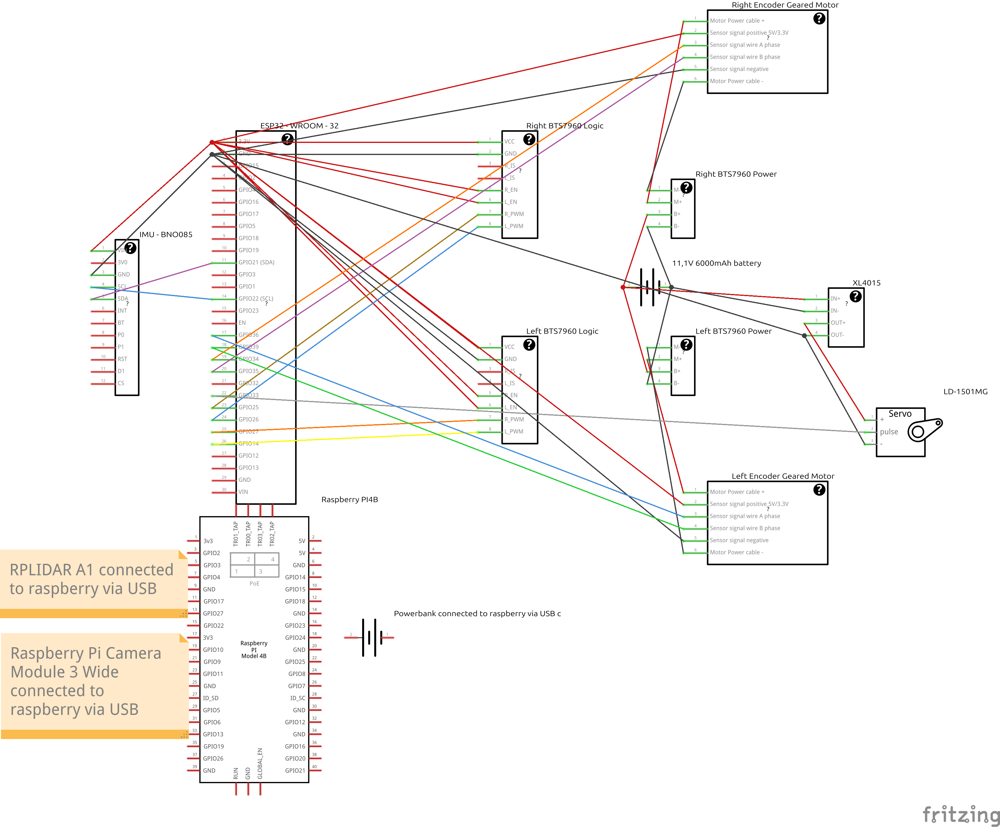

# Terrain-Adaptive Model Predictive Control for Autonomous Ackermann Vehicles

[](https://github.com/Gelminaio/adaptive-mpc-ackermann/actions)
[](https://opensource.org/licenses/MIT)
[](https://docs.ros.org/en/jazzy/)

A 1:10 scale autonomous vehicle platform implementing **adaptive Nonlinear Model Predictive Control** with **proprioceptive terrain classification** for robust navigation across heterogeneous surfaces.

---

## Abstract

This project investigates terrain-adaptive trajectory tracking for small-scale autonomous ground vehicles. A Nonlinear MPC controller, formulated on an identified dynamic bicycle model, regulates trajectory tracking under nonholonomic Ackermann constraints. An online proprioceptive terrain classifier — operating on inertial measurements alone — estimates the surface type at runtime, and the MPC cost weights and constraints are adapted accordingly. The full stack runs distributed over a ROS 2 Jazzy network spanning an ESP32 real-time controller, a Raspberry Pi 4 perception bridge, and a base-station GPU host. Validation is performed both in simulation (sim-to-real pipeline) and on the physical platform across multiple terrain types.

---

## Architecture



The system is organized in three computational tiers:

- **ESP32 (real-time layer)** — low-level motor PID, encoder reading, IMU acquisition, servo control. Communicates with the RPi via micro-ROS over USB serial.
- **Raspberry Pi 4 (perception bridge)** — camera capture and compression, LIDAR driver, micro-ROS agent, ROS 2 networking over WiFi.
- **Base station (Ubuntu 24.04 desktop)** — heavy compute: SLAM, perception, NMPC solver, terrain classifier, simulation, RViz visualization.

> 📌 **TODO**: replace the Fritzing schematic with a proper system architecture diagram (ROS 2 nodes + data flow).

---

## Hardware Bill of Materials

| Component | Model | Role | Approx. Cost (EUR) |
|---|---|---|---|
| SBC (perception bridge) | Raspberry Pi 4B (4GB) | Sensors hub, ROS 2 networking | 100 |
| Power supply (RPi) | USB-C Powerbank | RPi mobile power | 20 |
| MCU (real-time control) | ESP32-WROOM-32 | Motor PID, encoders, IMU, servo | 8 |
| IMU | Bosch BNO085 | 9-DoF with onboard sensor fusion | 36 |
| LIDAR | Slamtec RPLIDAR A1 | 2D 360° laser scan | 110 |
| Camera | Raspberry Pi Camera Module 3 Wide | RGB perception (CSI) | 38 |
| Motor drivers (×2) | BTS7960 (Half-bridge) | DC motor power stage | 17.5 |
| Step-down converters (×5 pack) | XL4015 | 11.1V → 6V (servo rail) and auxiliary rails | 16 |
| Chassis kit (1:10 RC) | Custom assembly | Mechanical base + 2× geared motors w/ quadrature encoders + LD-1501MG steering servo + 3S LiPo 11.1V 6000 mAh battery | 140 (~100 USD + shipping & customs) |
| **Total** | | | **~485** |

> 📌 **TODO**: add exact links to each component, photos of the physical assembly.

---

## Software Stack

| Layer | Technology |
|---|---|
| Real-time firmware | C++ / Arduino-ESP32 / FreeRTOS, micro-ROS |
| Middleware | ROS 2 Jazzy Jalisco |
| Perception | OpenCV, YOLOv8 (TBD), `camera_ros`, `rplidar_ros` |
| State estimation | `robot_localization` (EKF), custom EKF (Python/C++) |
| SLAM & navigation | `slam_toolbox`, Nav2 (Smac Hybrid-A* planner) |
| Control | NMPC via [`acados`](https://docs.acados.org/) |
| Simulation | Gazebo Harmonic / NVIDIA Isaac Sim |
| ML (terrain classifier) | PyTorch, scikit-learn |
| Tooling | Docker, PlatformIO, colcon, GitHub Actions |

---

## Repository Structure

```
adaptive-mpc-ackermann/
├── firmware/           # ESP32 firmware (PlatformIO)
├── ros2_ws/src/        # ROS 2 packages (perception, control, bringup)
├── simulation/         # Gazebo / Isaac Sim worlds and launch files
├── docker/             # Dockerfile and compose for base station
├── docs/               # Technical documentation (MkDocs)
├── notebooks/          # System identification, data analysis, plots
├── scripts/            # Calibration, test, plotting utilities
├── config/             # Shared YAML configs (vehicle params, EKF, MPC)
├── media/              # Diagrams, photos, demo videos
└── README.md
```

---

## Getting Started

> 📌 **TODO**: complete this section once Phase 2 (ROS 2 bridge) is done.

### Prerequisites

- Ubuntu 24.04 LTS (base station)
- Docker 24+
- ROS 2 Jazzy Jalisco
- PlatformIO IDE (for firmware development)

### Quick Start

```bash
# Clone
git clone https://github.com/Gelminaio/adaptive-mpc-ackermann.git
cd adaptive-mpc-ackermann

# Build base-station Docker environment
docker compose -f docker/docker-compose.yml build

# Flash firmware (ESP32 connected via USB)
cd firmware && pio run --target upload
```

Detailed setup, calibration, and deployment instructions: see [`docs/`](docs/).

---

## Project Roadmap

The project is structured in 12 incremental phases, from physical hardware assembly to academic publication:

- [x] **Phase 1** — Hardware assembly & electrical integration
- [x] **Phase 2** — Infrastructure & repository setup
- [ ] **Phase 3** — ESP32 firmware: motor drivers, PID, IMU, micro-ROS
- [ ] **Phase 4** — ROS 2 bridge & sensor pipelines
- [ ] **Phase 5** — Vehicle dynamic modeling & system identification
- [ ] **Phase 6** — State estimation (EKF)
- [ ] **Phase 7** — SLAM & Nav2 baseline
- [ ] **Phase 8** — Simulation & digital twin (sim-to-real)
- [ ] **Phase 9** — NMPC baseline (acados)
- [ ] **Phase 10** — Proprioceptive terrain classification
- [ ] **Phase 11** — Adaptive MPC with online terrain estimation
- [ ] **Phase 12** — Validation, benchmarking, technical report

Track progress via [GitHub Milestones](../../milestones).

---

## Results

> 📌 **TODO**: populate with figures, plots, and demo videos as phases complete.

Planned deliverables include:
- Trajectory tracking benchmark: NMPC vs. Pure Pursuit vs. Stanley vs. linear MPC
- Terrain classification confusion matrix and real-time inference latency
- Adaptive vs. fixed MPC comparison across mixed-terrain scenarios
- Sim-to-real transfer gap analysis

---

## Citation

If you use this work, please cite:

```bibtex
@misc{gelmini2026adaptivempc,
    title  = {Terrain-Adaptive Model Predictive Control for Autonomous Ackermann Vehicles},
    author = {Gelmini, Pietro},
    year   = {2026},
    note   = {Work in progress},
    url    = {https://github.com/Gelminaio/adaptive-mpc-ackermann}
}
```

> 📌 **TODO**: update once preprint / report is published on arXiv.

---

## License

This project is released under the [MIT License](LICENSE).

---

## Contact

**Pietro Gelmini** — [gelmini.pietro@gmail.com](mailto:gelmini.pietro@gmail.com)
LinkedIn: [linkedin.com/in/yourprofile](https://www.linkedin.com/in/pietro-gelmini/)

---

*This is an active research/engineering project. Architecture, methodology, and results are subject to change as work progresses.*